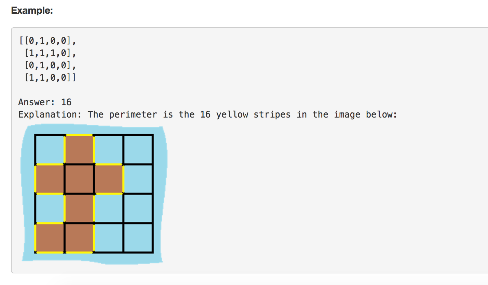

## 题目介绍

You are given a map in form of a two-dimensional integer grid where 1 represents land and 0 represents water. Grid cells are connected 
horizontally/vertically (not diagonally). 

The grid is completely surrounded by water, and there is exactly one island (i.e., one or more connected 
land cells). 

The island doesn't have "lakes" (water inside that isn't connected to the water around the island). One cell is a square with side 
length 1. The grid is rectangular, width and height don't exceed 100. Determine the perimeter of the island.

## 解法

遍历每一块陆地，查找四周，如果是海水则+1，如果是边界也+1，这样的花费时间是O(mn)

但是一定存在更加高效的解法的，不然没有利用`不存在lakes`这个条件。