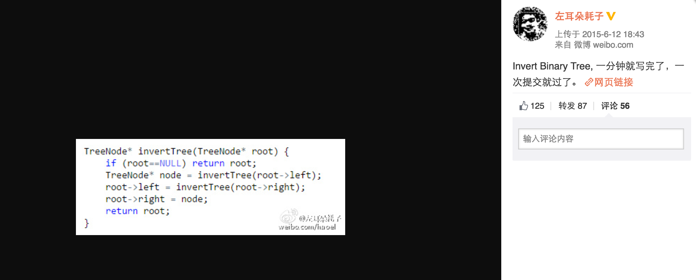

leetcode solutions :-)

### Serialize and Deserialize BST

encode和decode二叉树，解决方案是从leetcode的discuss中找到的，按照深度优先来把二叉树转成字符。具体可以查看代码。

在写测试程序的时候，注意到reconstruct方法中有`new`，意识到会有内存泄露，所以补上了`destroy_tree`方法。

```cpp
void destroy_tree(TreeNode *node){
    if (node){
        destroy_tree(node->left);
        destroy_tree(node->right);
        delete node;
        node = NULL;
    }
    return;
}
//......
TreeNode *root = c.deserialize(a);
printf("%d\n", root->val);
destroy_tree(root);
return 0;
```

让我想起了在2015年面试阿里的时候，面试官问我`delete`之后需不需要把ptr置为NULL，我没回答上来，后来才百度知道：

> delete一个指针之后，只是回收指针指向位置的空间，而指针本身的值不变（也就是说还是指向那个地址的）。你需要手工将其赋值为NULL。

### sum of two integers

不使用`+`和`-`号实现相加。

这个查看别人博客的思路是使用与和或实现，自己写出来后发现在leetcode上评测是超时，看了下网上的正解，使用了MASK来防止整数的overflow。代码如下，我目前也无法理解为什么最后一句可以起作用。

```py
MASK = 0x100000000  # 4294967296 = 2 ** 32
MAX_INT = 0x7FFFFFFF
MIN_INT = 0x80000000
while True:
    result = (a ^ b) % MASK
    carry = ((a & b) << 1) % MASK
    a = result
    b = carry
    if b == 0:
        break
return result if result < MAX_INT else ~((result % MIN_INT) ^ MAX_INT)
```

### 反转二叉树

题目如下：

```
Invert a binary tree.

     4
   /   \
  2     7
 / \   / \
1   3 6   9

to

     4
   /   \
  7     2
 / \   / \
9   6 3   1
```

PS: Google: 90% of our engineers use the software you wrote (Homebrew), but you can’t invert a binary tree on a whiteboard so fuck off.

这个题目的解法比较简单，就是递归把root的left和right对换下。

```py
def invertTree(self, root):
    """
    :type root: TreeNode
    :rtype: TreeNode
    """
    if root is None:
        return
    tmp = root.left
    root.left = root.right
    root.right = tmp
    self.invertTree(root.left)
    self.invertTree(root.right)
    return root
```

当时这个问题真的很火，homebrew的作者在google面试中因为不会反转二叉树而被拒，然后国内一群大佬程序员纷纷晒解法。

比如@左耳耗子：



### BinaryTreePaths

题目就是求深度优先遍历的路径。

低效率版本是我自己写的，虽然accept了，但是效率不高。使用深度遍历，每到一个node都有之前的path，如果这个node是空的，则把path加入到结果中，这个方法存在很多复制，效率不高。如`BinaryTreePaths/BinaryTreePaths.cpp`中的一样。

高效点的方式呢？看到discuss中`https://discuss.leetcode.com/topic/21447/c-simple-4ms-recursive-solution`的解法，不使用vector，效率提高很多。

```cpp
void binaryTreePaths(vector<string>& result, TreeNode* root, string t) {
    if(!root->left && !root->right) {
        result.push_back(t);
        return;
    }

    if(root->left) binaryTreePaths(result, root->left, t + "->" + to_string(root->left->val));
    if(root->right) binaryTreePaths(result, root->right, t + "->" + to_string(root->right->val));
}

vector<string> binaryTreePaths(TreeNode* root) {
    vector<string> result;
    if(!root) return result;
    
    binaryTreePaths(result, root, to_string(root->val));
    return result;
}
```

经过测试，这个效率依旧不高。